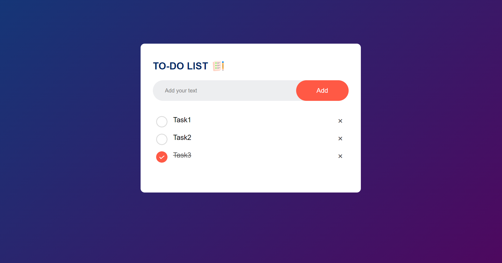

---

# To-Do List - JavaScript

This is a simple and interactive To-Do List web application built using HTML, CSS, and JavaScript. It allows users to add, check, and delete tasks, with the data being stored locally in the browser's local storage.



## Features

- **Add Tasks**: Users can add new tasks to the list.
- **Mark Tasks as Completed**: Clicking on a task marks it as completed.
- **Delete Tasks**: Users can remove tasks from the list.
- **Local Storage**: The tasks persist in local storage, so they remain even after the page is reloaded.

## Requirements

Before you begin, ensure you have met the following requirements:

1. **Web Browser**: A modern web browser such as Chrome, Firefox, Safari, or Edge.
2. **Text Editor**: A text editor like VSCode, Sublime Text, or Notepad++ (optional, for editing code).

## Installation

To set up this project locally, follow these steps:

1. **Clone the Repository**: Clone this repository to your local machine using the command:
   ```bash
   git clone https://github.com/Lokesh-666/To-Do-List-JS.git
   ```

2. **Navigate to the Project Directory**: 
   ```bash
   cd To-Do-List-JS
   ```

3. **Open `index.html` in a Web Browser**: You can directly open the `index.html` file in your preferred web browser to run the application.

## Usage

1. **Add a Task**: Type your task into the input field and click the "Add" button.
2. **Mark a Task as Completed**: Click on any task to mark it as completed.
3. **Delete a Task**: Click the "×" icon next to a task to delete it.

## File Structure

```
To-Do-List-JS/
│
├── index.html         # The main HTML file for the application
├── style.css          # The CSS file for styling the application
├── script.js          # The JavaScript file for the application logic
└── images/            # Contains the images used in the application
    ├── icon.png
    ├── unchecked.png
    └── checked.png
```

## Code Overview

- **HTML (`index.html`)**: Defines the structure of the web page.
- **CSS (`style.css`)**: Provides styles and layout for the application.
- **JavaScript (`script.js`)**: Contains the functionality to add, delete, and save tasks.

### Key JavaScript Functions

- `AddTask()`: Adds a new task to the list and updates local storage.
- `saveData()`: Saves the current list to local storage.
- `showData()`: Loads tasks from local storage when the page is loaded.

## Contributing

Contributions are welcome! If you have any suggestions or improvements, feel free to create an issue or make a pull request.

1. Fork the Project
2. Create your Feature Branch (`git checkout -b feature/AmazingFeature`)
3. Commit your Changes (`git commit -m 'Add some AmazingFeature'`)
4. Push to the Branch (`git push origin feature/AmazingFeature`)
5. Open a Pull Request

## License

This project is licensed under the MIT License. See the [LICENSE](LICENSE) file for more details.

## Acknowledgements

- Inspired by various online tutorials on building a to-do list with JavaScript.

---

Explore the [repository](https://github.com/Lokesh-666/To-Do-List-JS.git) for more details and have fun coding!

---
